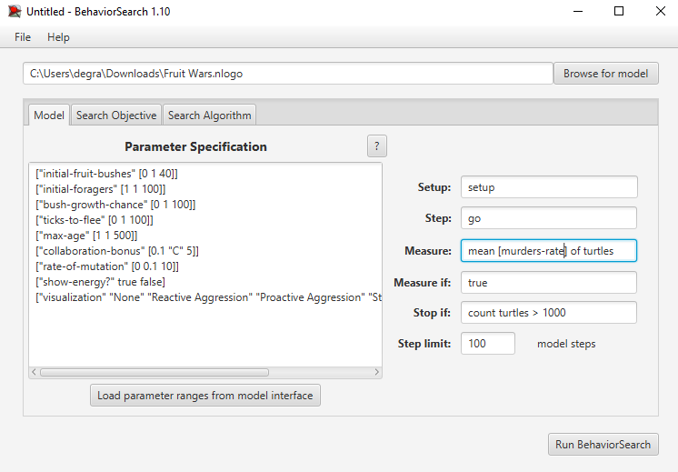
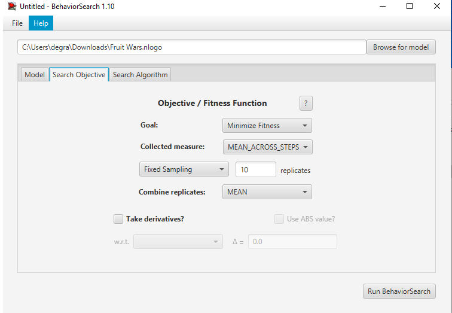
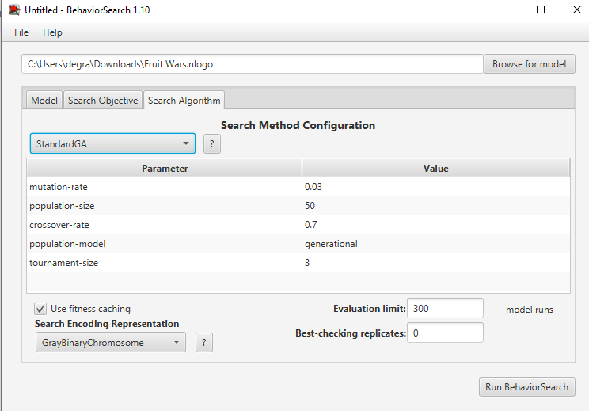
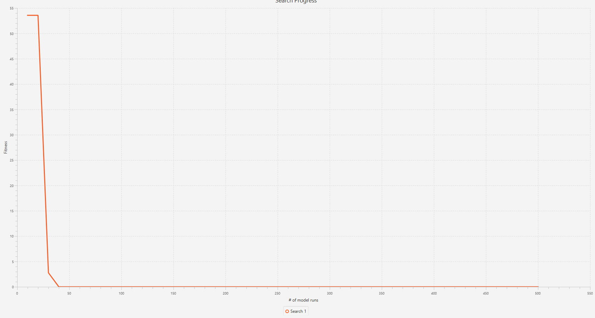
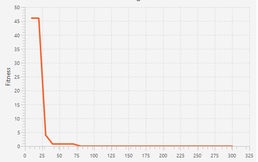

## Комп'ютерні системи імітаційного моделювання
## СПм-22-5, **Шевчук Євген Вадимович**
### Лабораторна робота №**3**. Використання засобів обчислювального интелекту для оптимізації імітаційних моделей

### Варіант 13, модель у середовищі NetLogo: [Fruit Wars](https://www.netlogoweb.org/launch#http://www.netlogoweb.org/assets/modelslib/Sample%20Models/Social%20Science/Economics/Fruit%20Wars.nlogo)

### Вербальний опис моделі:
Модель Fruit Wars має на меті продемонструвати, як економічне середовище з ненульовою сумою може заохочувати співпрацю та перешкоджати насильству. Здобувачі корму блукають по карті в пошуках плодових чагарників. Коли вони прибувають до плодового куща, вони отримують енергію шляхом пошуку їжі, доки плодовий кущ не вичерпає ресурси. Ці здобувачі розмножуються та передають свої характеристики нащадкам після збору певної кількості енергії. Вони також приймають рішення на основі спадкових параметрів щодо того, як взаємодіяти з іншими здобувачами, які шукають їжу. Здобувачі їжі можуть співпрацювати, погрожувати, воювати чи тікати за різних обставин.

У моделі здобувачі можуть або співпрацювати, або боротися на основі спадкових атрибутів агресії. Параметр бонус-співпраці у моделі контролює, наскільки корисною є співпраця з точки зору пошуку їжі, тому слід очікувати, що еволюційна рівновага системи рухається в бік збирачів з менш жорстокими тенденціями, коли модель запускається з вищими налаштуваннями бонусу-співпраці.

### Початкові Параметри
- **initial-fruit-bushes** визначає початкову кількість плодових кущів
- **initial-foragers** визначає початкову кількість здобувачів їжі

### Параметри візуалізації
- **show-energy** відображати кількість енергії кожного збирача
- **visualisation** змінює тональність кольору агента в залежності від значення вибранного параметра, чим світліший тон кольору тим вище значення параметру

### Керуючі параметри:
- **ticks-to-flee** кількість ходів пересування збирача в випадкову сторону перед тим як він почне шукати кущі
- **rate-of-mutation** вірогідність зміни геному і передачі його до потомства
- **collaboration-bonus** бонус поживності одного куща для декількох збирачів
- **max-age** максимальна кількість ходів яку здобувач може прожити
- **bush-grow-chance** визначає шанс на появу нового плодового куща в кожний хід

### Внутрішні параметри:

- **speed** швидкість руху збирача
- **proactive-aggression** ймовірність захисту
- **reactive-aggression** ймовірність загрози
- **energy** метаболічна енергія збирача
- **genome** список що кодує успадковані параметри збирача
- **foraging** чи збирає збирач зараз фрукти
- **fleeing** чи збирач втікає
- **fleeing-turns** кількість ходів для втікання
- **age** вік збирача в ходах
- **strength** сила для боротьби
- **intelligence** інтеллект для группового збирання
- **amount** кількість енергії в кущі

### Показники роботи системи:
- загальна кількість збирачив
- середня кількість збирачів
- швидкість збирання
- швидкість змін сили, інтелекту і швидкості збирачів
- швидкість збирання
- відсоток вбивств від загальної кількості смертей
- відсоток смертей від голоду від загальної кількості смертей
- відсоток смертей від старості від загальної кількості смертей
- реактивна/проактивна агрессія

**Обрана модель**:
[Fruit Wars](http://www.netlogoweb.org/launch#http://www.netlogoweb.org/assets/modelslib/Sample%20Models/Social%20Science/Economics/Fruit%20Wars.nlogo).

### Параметри моделі:
Параметри та їх діапазони були автоматично вилучені середовищем BehaviorSearch із вибраної імітаційної моделі, для цього скористаємось кнопкою «Load parameter ranges from model interface»:
```
["initial-fruit-bushes" [0 1 40]]
["initial-foragers" [1 1 100]]
["bush-growth-chance" [0 1 100]]
["ticks-to-flee" [0 1 100]]
["max-age" [1 1 500]]
["collaboration-bonus" [0.1 "C" 5]]
["rate-of-mutation" [0 0.1 10]]
["show-energy?" true false]
["visualization" "None" "Reactive Aggression" "Proactive Aggression" "Strength" "Speed" "Intelligence"] 
```

### Міра фітнес-функції
В якості міри для фітнес-функції використано значення частоти вбивств збирачів в середовищі існування. Вираз цієї міри узято з налаштувань графіка імітаційної моделі в середовищі NetLogo:
```
min [ murders-rate ] of turtles
```
Скриншот панелі налаштування параметрів приведено на малюнку:


### Налаштування цільової функції (Search Objective)
Метою підбору параметрів для імітаційної моделі є максимльне зменшення значення кількості збирачів у середовищі існування.

Ми вказуємо це за допомогою значення Minimize Fitness в параметрі "Goal". При чому, важливо, що нас має цікавити не значення популяції в окремий момент симуляції, а середнє значення протягом всієї симуляції, тривалість якої 500 кроків. Для цього в параметрі "Collected measure" вказуємо значення MEAN_ACROSS_STEPS. Щоб уникнути спотворення результатів через випадкові значення, що використовуються в логіці самої імітаційної моделі, кожна симуляція повторюється по 10 разів, результат розраховується як середнє арифметичне.

Скриншот панелі налаштування параметрів цільової функції:


### Налаштування алгоритму пошуку (Search Algorithm)
На цьому етапі було визначено модель, налаштовані її параметри, і вибрано міру ефективності, що лежить в основі функції пристосованості, що дозволяє оцінити "якість" кожного з варіанта рішення, що перевіряється BehaviorSearch. У ході дослідження будуть використовуватися два алгоритми: Випадковий пошук (RandomSearch) і Простий генетичний алгоритм (StandardGA). Для цих алгоритмів необхідно вказати "Evaluation limit" (число ітерацій пошуку, у разі GA - це буде число поколінь), та "Search Space Encoding Representation" (спосіб кодування варіанта рішення). Загальноприйнятого "кращого" способу кодування немає, неохідно визначити, які підходять для поточної моделі. Параметр "Use fitness caching" впливає тільки на продуктивність.


### Налаштування StandardGA алгоритму пошуку:
Результати для StandardGA алгоритму пошук:


```
initial-fruit-bushes=     16
initial-foragers    =     93
bush-growth-chance  =     63
ticks-to-flee       =     64
max-age             =      7
collaboration-bonus =4.00901
rate-of-mutation    =    7.7
show-energy?        =   true
visualization       =Proactive Aggression

Fitness= 0.00000
```

### Налаштування RandomSearch алгоритму пошуку:
Результати для RandomSearch алгоритму пошуку:


```
initial-fruit-bushes=      2
initial-foragers    =     22
bush-growth-chance  =     41
ticks-to-flee       =     45
max-age             =     71
collaboration-bonus =4.13694
rate-of-mutation    =    3.7
show-energy?        =   true
visualization       =Proactive Aggression

Fitness= 0.00000
```